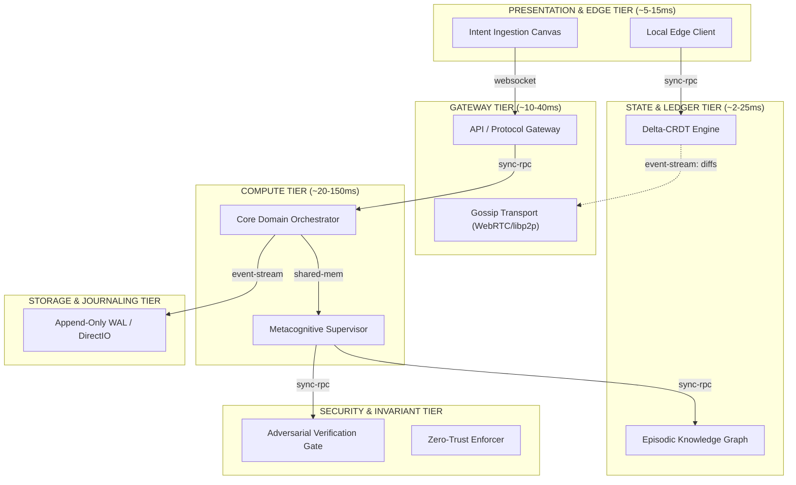

# GESTALT // Cognitive Topology & Socratic Blueprint Extractor

[](#)
[](#)
[](#)
[](#)
[](#)

> **Overcoming the Serialization Bottleneck in Human-AI Interaction.**  
> Stop stuffing multi-dimensional mental blueprints through the 40-bit/second straw of text prompts. Extract topologies, resolve high-entropy architectural forks in 1 click, and synthesize runnable code with runtime invariant assertions.

---

## 1. The Core Problem: The Serialization Bottleneck

When you conceive a software architecture, an algorithm, or a distributed system, your mind holds a **high-dimensional, non-linear mental graph**:
* Components, boundaries, and spatial topologies exist **simultaneously**.
* Trade-offs, causal chains, and unspoken invariants are held in **parallel**.

Spoken and written language was an evolutionary acoustic protocol developed thousands of years ago to push vibrations through the air at roughly **40 to 60 bits per second**. 

```
TRADITIONAL PROMPT ENGINEERING:
[High-Dimensional Mental Blueprint] 
       │
       ▼ (Violent lossy compression through 40-bit/s text straw)
[500-Word Prompt Essay] 
       │
       ▼
[AI Hallucinates Generic CRUD / Misunderstands Invariants]
       │
       ▼
[User Spends 45 Minutes Writing More Explanations]
```

**Gestalt inverts this interaction completely:**

```
THE GESTALT COGNITIVE EXTRACTION PARADIGM:
[Raw Intuition / 1-Sentence Spark]
       │
       ▼
[Instant High-Dimensional Topological Projection (6 Tiers, Budgets, Invariants)]
       │
       ▼
[Socratic Bifurcation Probing: 1-Click High-Entropy Trade-Off Decision Cards]
       │
       ▼
[Crystallized Architecture: Live ADR + Mermaid Diagrams + Runnable Python Actors]
```

---

## 2. Interactive System Topology

Gestalt stratifies any application concept into 6 strictly governed architectural tiers with explicit latency budgets and protocol edges:



---

## 3. Key Capabilities

### 1. Zero-Prompt Topological Projection
Enter a raw spark (*"Decentralized local-first collaborative canvas with peer-to-peer CRDT and zero cloud storage"*) or select an archetype chip. Gestalt instantly materializes:
* **Stratified Component Nodes**: ID, tier, state model (`stateless`, `in-memory`, `persistent`, `crdt`, `append-only`), and latency budget.
* **Information Channels**: Protocols (`grpc`, `websocket`, `event-stream`, `shared-mem`, `p2p`, `sync-rpc`) with synchronous vs. asynchronous distinction.
* **Non-Negotiable System Invariants**: Critical architectural boundary contracts enforced at compile and runtime.

### 2. High-Bandwidth Socratic Bifurcation Engine
Instead of asking you to write 10 paragraphs of edge cases, Gestalt computes the **highest-entropy architectural forks** and presents 1-click decision cards:
* **Example Fork**: *State Authority & Conflict Resolution*
  * **Option A**: *Delta-CRDT (Last-Write-Wins + Vector Clocks)* — Mathematical convergence, zero coordinator, higher metadata overhead.
  * **Option B**: *Optimistic Peer-Consensus (Dynamic Raft Quorum)* — Guaranteed ordering, requires 51% peer quorum.
* **Clicking one option (1 second)** resolves the equivalent of 500 words of design choices, updates the graph in real-time, adds new sentinel nodes, and raises the **Latent Convergence Meter** (e.g. `30%` $\rightarrow$ `60%` $\rightarrow$ `90%`).

### 3. Living Topology Canvas
* **Interactive Physics Layout**: Drag and inspect components.
* **Animated Particle Streams**: Directional pulses along edges show real-time information flow.
* **Node Inspector**: Click any component to inspect state models, latency ceilings, and invariants.

### 4. Executable Code & Deliverable Synthesis
* **Architecture Decision Record (ADR)**: Generated markdown log documenting every architectural choice, context, and accepted trade-off.
* **Mermaid System Diagram**: Clean, presentation-ready diagrams.
* **Runnable Python Actor System**: Generates `main.py` and `invariants.py` with runtime invariant assertions:
  ```python
  SystemInvariants.assert_latency(self.node_id, elapsed_ms, self.latency_budget_ms)
  ```

---

## 4. Built-in Production Archetypes

Gestalt ships with a rich knowledge base of 10+ battle-tested architectural paradigms, plus a dynamic compositional synthesizer for arbitrary ideas:

1. **Autonomous Multi-Agent Swarms**: Supervisor, episodic memory graph, specialist workers, adversarial verifiers.
2. **Local-First & P2P CRDT**: Vector clock sentries, gossip transports, WebRTC hole punchers, relay witnesses.
3. **Ultra-Low-Latency Trading (HFT)**: LMAX Disruptor lock-free ring buffers, kernel bypass (DPDK), hardware pre-trade risk filters.
4. **Authoritative Multiplayer Game Servers**: ECS world simulation loops, spatial BVH grids, lag rewind compensation.
5. **Real-Time Computer Vision**: Hardware-accelerated GPU pipelines (TensorRT/CUDA), ByteTrack spatial tracking, zero-copy frames.
6. **IoT Edge Sensor Networks**: MQTT/CoAP brokers, time-series delta compressors, adaptive cellular duty cycling.
7. **Zero-Trust Cybersecurity & SIEM**: eBPF kernel hooks, network packet mirrors, automated quarantine gateways, immutable audit logs.
8. **Autonomous Robotics & Drones**: ROS2 micro-nodes, LiDAR SLAM occupancy grids, hard real-time PID watchdog interlocks.
9. **Developer Tooling & Compilers**: Language Server Protocol (LSP) handlers, incremental Tree-Sitter AST parsers, sandbox runners.
10. **Ultra-Low-Latency Media SFU**: WebRTC simulcast forwarding, ephemeral presence meshes, CDN edge segment caches.

---

## 5. Security Architecture & Threat Model

Gestalt was built from the ground up with defensive engineering principles to ensure safe local execution:

| Threat Vector | Mitigation Strategy Implemented |
| :--- | :--- |
| **Cross-Site Request Forgery (CSRF / Rebinding)** | CORS is strictly restricted to loopback origins (`localhost:8000`, `127.0.0.1:8000`). Public website scripts cannot query local APIs. |
| **Path Traversal Attacks** | Session IDs and export file paths are sanitized via regex (`^[a-zA-Z0-9_\-]+$`) and strictly verified using `Path.is_relative_to()`. |
| **Server-Side Request Forgery (SSRF)** | Local model endpoints are validated against URL schemes and restricted to local loopback hosts (`127.0.0.1`, `localhost`). |
| **Arbitrary Code Execution in Synthesis** | Synthesized code uses `json.dumps()` escaping and alphanumeric identifier sanitization to prevent AST/code injection into scaffolding. |
| **DOM XSS Injection** | User-controlled seed fragments and notes are HTML-entity escaped before DOM insertion. |

---

## 6. Quickstart Guide

### Prerequisites
* Python 3.10+
* (Optional) [Ollama](https://ollama.ai) or [LM Studio](https://lmstudio.ai) for local LLM inference.

### Installation
```bash
# Clone the repository
git clone https://github.com/ModernOps888/gestalt-blueprint.git
cd gestalt-blueprint

# Install dependencies
pip install fastapi uvicorn pydantic requests
```

### Running the Studio
```bash
# Double-click run.bat or run via terminal:
python -m uvicorn server:app --host 127.0.0.1 --port 8000 --reload
```
Open your browser to: **`http://127.0.0.1:8000`**

### Using with Local Models (Ollama / LM Studio)
Gestalt works out-of-the-box with its zero-latency **Autonomous Cognitive Heuristics Engine**. To use your local LLM:
1. Run Ollama: `ollama run llama3.2` (or mistral, qwen2.5, phi3, deepseek).
2. Gestalt automatically connects to `http://localhost:11434`.
3. To configure custom endpoints, click the **Gear Icon** in the top navigation.

### Running Exported Code
1. Click **"Export Project to Disk"** inside the app.
2. Navigate to the export folder and run:
   ```bash
   python export/<session_id>/main.py
   ```

---

## 7. API Reference

| Method | Endpoint | Description |
| :--- | :--- | :--- |
| `GET` | `/api/status` | Returns local LLM connectivity status, active provider, and latency. |
| `POST` | `/api/project` | Projects a raw seed fragment into a topological blueprint and Socratic probes. |
| `POST` | `/api/probe/resolve`| Resolves an architectural fork, updates the graph, and increases convergence. |
| `POST` | `/api/synthesize` | Compiles the crystallized blueprint into ADR, Mermaid, and Python code. |
| `POST` | `/api/export` | Safely writes project files to disk for local execution. |
| `GET` | `/api/sessions` | Lists all saved blueprints in history. |
| `DELETE`| `/api/session/{id}` | Deletes a blueprint session from memory and disk. |

---

## 8. License

MIT License. Built for the future of human-AI cognitive collaboration.
