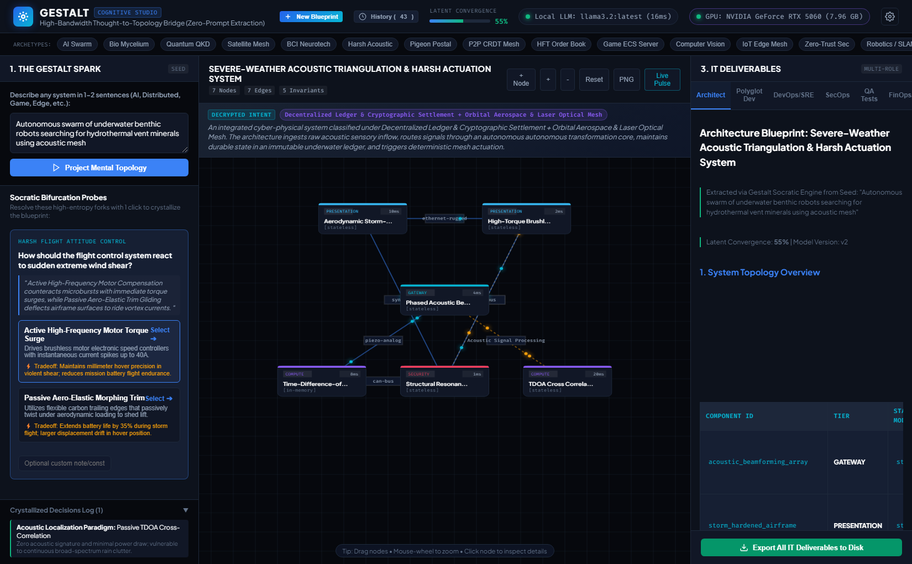
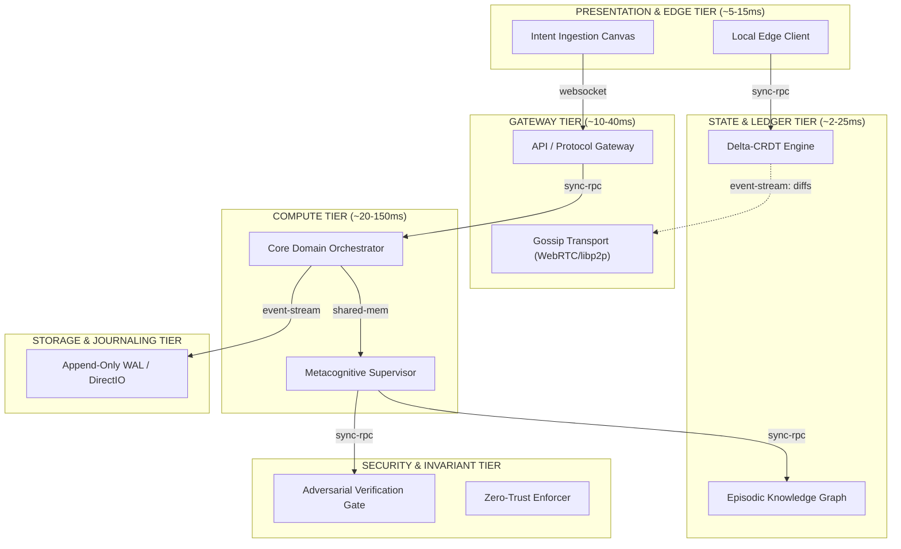

# GESTALT // Cognitive Topology & Socratic Blueprint Extractor

[](#)
[](#)
[](#)
[](#)
[](#)
[](#)

> **Overcoming the Serialization Bottleneck in Human-AI Interaction.**  
> Stop stuffing multi-dimensional mental blueprints through the 40-bit/second straw of text prompts. Extract topologies, resolve high-entropy architectural forks in 1 click, and synthesize runnable code, DevOps IaC, STRIDE threat models, and FinOps contracts.

---

## Live Dashboard Preview



*Figure: Gestalt Cognitive Studio extracting a live mental topology from an eccentric seed prompt on an RTX 5060 local GPU (16ms latency), resolving Socratic bifurcation forks, and generating structured ADR markdown tables.*

---

## 1. The Core Problem: The Serialization Bottleneck

When you conceive a software architecture, an algorithm, or a distributed system, your mind holds a **high-dimensional, non-linear mental graph**:
* Components, boundaries, and spatial topologies exist **simultaneously**.
* Trade-offs, causal chains, and unspoken invariants are held in **parallel**.

Spoken and written language was an evolutionary acoustic protocol developed thousands of years ago to push vibrations through the air at roughly **40 to 60 bits per second**. 

```
TRADITIONAL PROMPT ENGINEERING:
[High-Dimensional Mental Blueprint] 
       │
       ▼ (Violent lossy compression through 40-bit/s text straw)
[500-Word Prompt Essay] 
       │
       ▼
[AI Hallucinates Generic CRUD / Misunderstands Invariants]
       │
       ▼
[User Spends 45 Minutes Writing More Explanations]
```

**Gestalt inverts this interaction completely:**

```
THE GESTALT COGNITIVE EXTRACTION PARADIGM:
[Raw Intuition / 1-Sentence Spark]
       │
       ▼
[Instant High-Dimensional Topological Projection (6 Tiers, Budgets, Invariants)]
       │
       ▼
[Socratic Bifurcation Probing: 1-Click High-Entropy Trade-Off Decision Cards]
       │
       ▼
[Crystallized Architecture: Live ADR + Polyglot Code + DevOps IaC + STRIDE Security + QA Tests]
```

---

## 2. Interactive System Topology

Gestalt stratifies any application concept into 6 strictly governed architectural tiers with explicit latency budgets and protocol edges:



---

## 3. Major Platform Upgrades & Hardening

The platform has undergone a comprehensive engineering overhaul addressing topology sprawl, visual duplication, UI freezing, markdown table rendering, and local LLM unblocking:

### 1. Sprawl Prevention & Strict Node Budget
* **Hard Component Limit**: Architectures are capped at 8 nodes total (`MAX_NODES = 8`).
* **Semantic Stem Deduplication**: An automated filter inspects root stems (`stabiliz`, `autonom`, `verif`, `coordinat`, `supervis`, `monitor`, `detector`, `buffer`, `controller`). Rejects redundant components such as duplicate swarm controllers.
* **Controlled Growth**: Exactly 1 specialized node can be added per resolved Socratic probe.

### 2. Formal Invariant Validation
* **Elimination of Trivial Tags**: Rejects 1-2 word tags (e.g. `stability`, `autonomy`) in favor of complete architectural constraints.
* **Length and Word Validation**: Invariants must contain at least 5 words and 22 characters, specifying quantifiable metrics and bounds.
* **Cap of 6 Invariants**: Focuses the architecture on critical guardrails without noise.

### 3. Clean Convergence & Socratic Probe Retirement
* **Convergence Progression**: Latent convergence advances predictably from 15-30% on initial seed projection up to 100% upon fork crystallization.
* **Clean Probe Retirement**: Probe generation terminates once convergence reaches 85% or 3 forks are resolved, cleanly completing remaining probes at 100%.

### 4. Rich ADR Markdown Table & List Formatting
* **Structured Table Parsing**: Converts pipe-delimited ADR specifications into standard HTML `<table>` elements wrapped in `.table-wrap` with distinct alternating cell borders.
* **Numbered and Bullet Lists**: Parses markdown list elements into `.md-list-item` containers with cyan index badges and bullet indicators.

### 5. ActionLock Anti-Spam & UI Concurrency
* **Global ActionLock**: An atomic lock mechanism blocks rapid repeated clicks on probe options and buttons.
* **Crystallizing Spinner**: Sibling buttons are disabled immediately upon click, and the active choice displays an animated spinner (`Crystallizing Choice...`).
* **Server-Side Idempotency**: Resolving an already-resolved fork returns the current state immediately without reprocessing.

### 6. Event Loop Threadpool Unblocking
* **Asynchronous Offloading**: CPU-bound and synchronous HTTP calls to local LLMs run in AnyIO threadpools, ensuring the FastAPI event loop never stalls during status checks or live polling.

---

## 4. Multi-Role IT Deliverables

Gestalt is designed for every role across the engineering lifecycle:

| IT Role | Synthesized Deliverable | Purpose |
| :--- | :--- | :--- |
| **Software Architect** | `ARCHITECTURE.md` + Mermaid Diagram | Full ADR log, tier stratification, latency budgets, non-negotiable invariants. |
| **Polyglot Developer** | `main.py`, `index.ts`, `main.go` | Runnable asynchronous actors/goroutines matching topology channels. |
| **DevOps / SRE** | `Dockerfile` + `docker-compose.yml` | Multi-container service topology, health checks, Prometheus metrics. |
| **SecOps / CISO** | `THREAT_MODEL_STRIDE.md` | STRIDE risk analysis (Spoofing, Tampering, DoS) and mitigation matrix. |
| **QA / Chaos Engineer** | `test_suite.py` | Pytest-asyncio suite validating latency budgets, invariants, and chaos injection. |
| **Product Manager / FinOps**| `FINOPS_AND_SLO.md` | Cloud run-rate estimate, 99.95% SLA contracts, RTO/RPO targets. |

---

## 5. Cross-Platform Hardware Architecture & Multi-GPU Profiler

Gestalt integrates high-precision hardware discovery that probes physical and unified memory architectures to calibrate blueprint performance and generate hardware-accurate deliverables:

### 1. Cross-Platform Detection Matrix
* **Windows**: Direct `nvidia-smi` GPU query, fallback to WMI video controller topology, psutil / wmic CPU and RAM metrics.
* **Linux**: Dual NVIDIA CUDA (`nvidia-smi`) and AMD ROCm (`rocm-smi`) detection, `/proc/cpuinfo` hardware threads, and `/proc/meminfo` physical RAM.
* **macOS (Darwin)**: Metal unified memory allocation via `system_profiler SPDisplaysDataType` and `sysctl` machdep brand strings.

### 2. Spec Tier Classification & Guidance
| Spec Tier | Hardware Profile Boundary | Recommended Parameter Scale | Context Window Ceiling | Parallelism Strategy |
| :--- | :--- | :--- | :--- | :--- |
| **`ultra_multigpu`** | >= 24GB VRAM or 2+ Discrete GPUs | 32B to 70B parameters | 32,768 tokens | Tensor / Pipeline Parallel Split |
| **`high_gpu`** | 16GB to 24GB Discrete VRAM | 14B to 32B parameters | 16,384 tokens | Single Device Offload |
| **`mid_gpu`** | 6.5GB to 16GB Discrete VRAM (e.g. RTX 5060) | 3B to 8B parameters | 8,192 tokens | Single Device Offload |
| **`entry_gpu`** | 3.5GB to 6.5GB Discrete VRAM | 1B to 3B parameters | 4,096 tokens | Single Device Offload |
| **`edge_cpu`** | < 3.5GB VRAM or CPU-only | 1B to 3B parameters | 2,048 tokens | Multi-threaded CPU Quantization |

### 3. Factual VRAM Model Fit Evaluator
Gestalt calculates the exact 4-bit quantization (Q4_K_M) memory footprint and 4K context requirements for any local model:
* **Optimal (100% VRAM Offload)**: Required memory <= available VRAM. Runs at maximum native GPU speed (140 to 220+ tokens/sec).
* **Hybrid (System RAM Spillover)**: Required memory exceeds VRAM but fits within host RAM. Partial layer offloading with host memory paging.
* **Exceeds Capacity**: Model memory footprint exceeds total physical resources.

---

## 6. Built-in Production & Frontier Archetypes

Gestalt ships with a rich knowledge base of 16 architectural paradigms, plus a deep semantic concept decomposer that extracts domain physics, biology, and mechanics from any arbitrary, eccentric, or unconventional seed:

1. **Biodigital, Mycelium & Synthetic DNA**: Chemotactic receptors, hyphal calcium-wave action potential buses, enzymatic logic gates, oligonucleotide DNA memory vaults, luciferase photonic emitters, and biosecurity kill-switches.
2. **Covert Physical Carriers & Sneakernet**: Cryptographic microdot staging, avian homing flight vectors, automated perch traps with dual-RFID scanners, air-gapped optical ledger stations, and pyrophoric zeroizers.
3. **Fault-Tolerant Quantum & Post-Quantum Cryptography**: Cryogenic optical pumping, surface-code syndrome extraction, entangled photon routing, and hardware-accelerated ML-KEM post-quantum lattice co-processors.
4. **LEO Satellite Constellations & Optical Mesh**: Ground phased-array tracking, Keplerian Doppler compensation, inter-satellite laser crosslinks (FSO), and rad-hardened triple-modular-redundant flight computers.
5. **Intracortical BCI & Neuromorphic Decoders**: 1024-channel microelectrode arrays, analog front-end artifact filters, real-time spike sorting, kinematic intention decoders, and thermal tissue safety sentinels.
6. **Severe-Weather Acoustic Triangulation & Harsh Actuation**: Phased acoustic transducer beamforming, storm-hardened IP68 airframes, TDOA acoustic locators, and turbulence-compensated inertial navigation.
7. **Autonomous Multi-Agent Swarms**: Metacognitive supervisors, episodic memory graphs, specialist worker pools, and adversarial verification gates.
8. **Local-First & P2P CRDT**: Vector clock sentries, gossip transports, WebRTC hole punchers, and relay witnesses.
9. **Ultra-Low-Latency Trading (HFT)**: LMAX Disruptor lock-free ring buffers, kernel bypass (DPDK), and hardware pre-trade risk filters.
10. **Authoritative Multiplayer Game Servers**: ECS world simulation loops, spatial BVH grids, and lag rewind compensation.
11. **Real-Time Computer Vision**: Hardware-accelerated GPU pipelines (TensorRT/CUDA), ByteTrack spatial tracking, and zero-copy frame buffers.
12. **IoT Edge Sensor Networks**: MQTT/CoAP brokers, time-series delta compressors, and adaptive cellular duty cycling.
13. **Zero-Trust Cybersecurity & SIEM**: eBPF kernel hooks, network packet mirrors, automated quarantine gateways, and immutable audit logs.
14. **Autonomous Robotics & Drones**: ROS2 micro-nodes, LiDAR SLAM occupancy grids, and hard real-time PID watchdog interlocks.
15. **Developer Tooling & Compilers**: Language Server Protocol (LSP) handlers, incremental Tree-Sitter AST parsers, and sandbox runners.
16. **Ultra-Low-Latency Media SFU**: WebRTC simulcast forwarding, ephemeral presence meshes, and CDN edge segment caches.
17. **Dynamic Semantic Concept Decomposer**: Analyzes eccentric or novel raw prompts into domain-accurate components, communication edges, physical invariants, and high-entropy Socratic bifurcation probes.

---

## 7. Security Architecture & Defensive Controls

Gestalt is engineered with defensive principles to guarantee secure local execution:

| Threat Vector | Mitigation Strategy Implemented |
| :--- | :--- |
| **Cross-Site Request Forgery (CSRF / Rebinding)** | CORS is strictly restricted to loopback origins (`localhost:8000`, `127.0.0.1:8000`). Public website scripts cannot query local APIs. |
| **Path Traversal Attacks** | Session IDs and export file paths are sanitized via regex (`^[a-zA-Z0-9_\-]+$`) and strictly verified using `Path.is_relative_to()`. |
| **Server-Side Request Forgery (SSRF)** | Local model endpoints are validated against URL schemes and restricted to local loopback hosts (`127.0.0.1`, `localhost`). |
| **Arbitrary Code Execution in Synthesis** | Synthesized code uses `json.dumps()` escaping and alphanumeric identifier sanitization to prevent AST/code injection into scaffolding. |
| **DOM XSS Injection** | User-controlled seed fragments and notes are HTML-entity escaped before DOM insertion. |

---

## 8. Quickstart Guide

### Prerequisites
* Python 3.10+
* (Optional) [Ollama](https://ollama.ai) or [LM Studio](https://lmstudio.ai) for local LLM inference. Zero API keys required.

### Installation
```bash
# Clone the repository
git clone https://github.com/ModernOps888/gestalt-blueprint.git
cd gestalt-blueprint

# Install dependencies
pip install fastapi uvicorn pydantic requests pytest pytest-asyncio httpx
```

### Running the Studio
```bash
# Double-click run.bat or run via terminal:
python server.py
```
Open your browser to: **`http://127.0.0.1:8000`**

### Running the Test & Stress Suite
```bash
pytest
```
Executes 27 automated unit, integration, stress, and idempotency tests validating live host detection, cross-platform mocking (Linux ROCm, multi-GPU rigs, macOS Metal), model fit evaluations, dynamic eccentric raw prompt projections, rapid concurrent clicks, and sprawl prevention.

### Exporting Full Project Scaffolding
Click **"Export All IT Deliverables to Disk"** inside the app. It writes all files to `export/<session_id>/`:
* Python: `main.py`, `invariants.py`, `test_suite.py`
* TypeScript: `index.ts`
* Go: `main.go`
* DevOps: `Dockerfile`, `docker-compose.yml` (with GPU reservations)
* Security: `THREAT_MODEL_STRIDE.md`
* FinOps: `FINOPS_AND_SLO.md` (with hardware run-rate analysis)
* Architecture: `ARCHITECTURE.md`

Run the synthesized pipeline:
```bash
python export/<session_id>/main.py
```

---

## 9. API Reference

| Method | Endpoint | Description |
| :--- | :--- | :--- |
| `GET` | `/api/status` | Returns local LLM connectivity, active model, host hardware summary, and model fit matrix. |
| `GET` | `/api/hardware` | Returns detailed cross-platform hardware profile, multi-GPU topology, and spec tier. |
| `POST` | `/api/project` | Projects a raw seed fragment into a topological blueprint with hardware invariants. |
| `POST` | `/api/probe/resolve`| Resolves an architectural fork, updates the graph, and increases convergence. |
| `POST` | `/api/synthesize` | Compiles the crystallized blueprint into multi-role IT deliverables. |
| `POST` | `/api/export` | Safely writes all polyglot, devops, secops, QA, and finops files to disk. |
| `POST` | `/api/node/custom` | Injects a user-defined custom component node into the live canvas. |
| `POST` | `/api/edge/custom` | Connects two nodes with a custom protocol edge. |
| `GET` | `/api/sessions` | Lists all saved blueprints in history. |
| `DELETE`| `/api/session/{id}` | Deletes a blueprint session from memory and disk. |

---

## 10. License

MIT License. Built for the future of human-AI cognitive collaboration.
